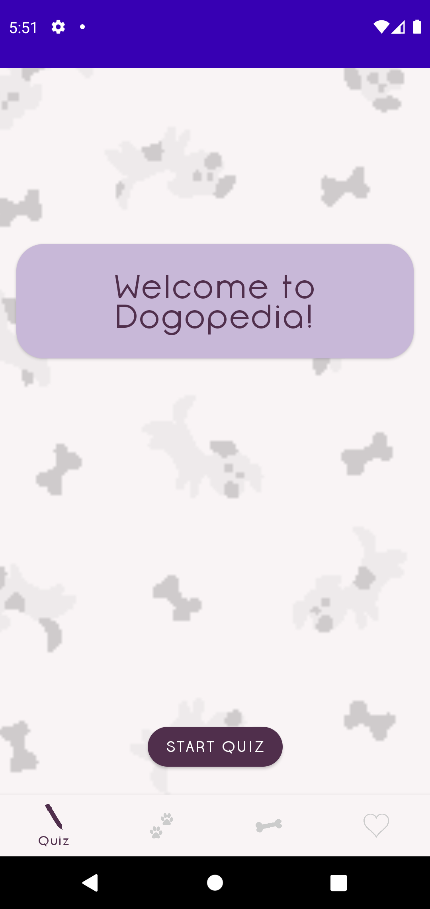
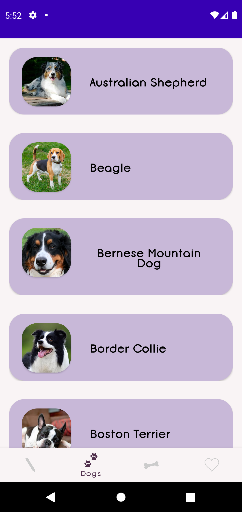
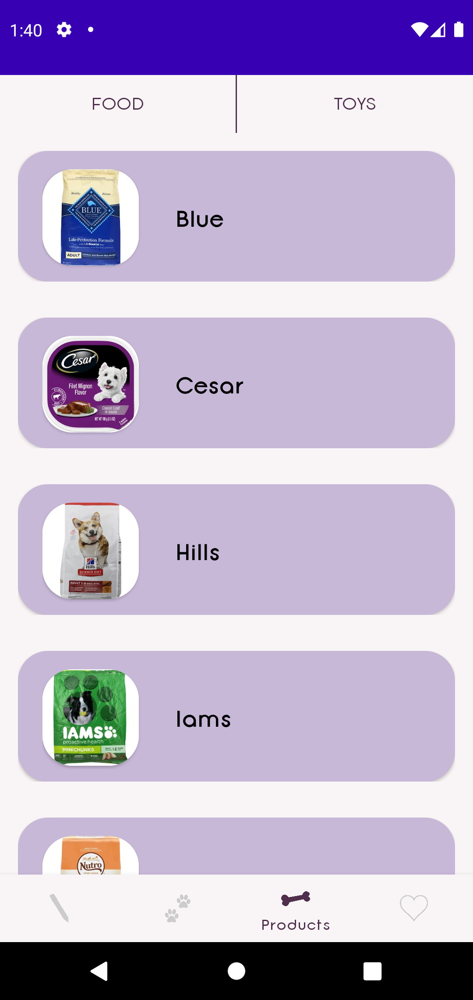
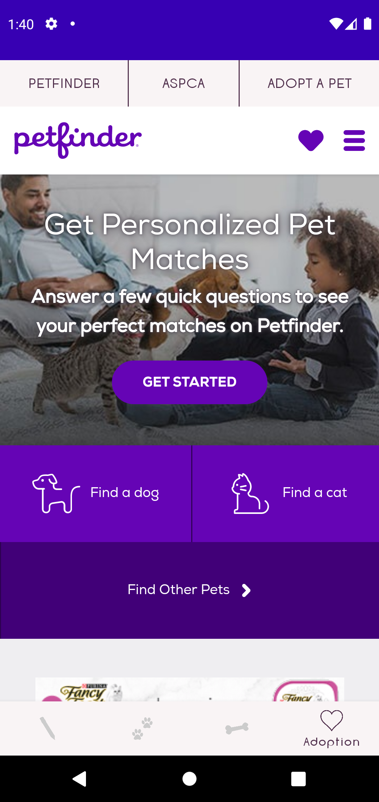

[![Contributors][contributors-shield]][contributors-url]
[![Release][release-shield]][release-url]

<!-- LOGO -->
 

    

<!-- TABLE OF CONTENTS -->

  
Table of Contents

  <ol>
    <li>
      <a href="#about-the-project">About The Project</a>
      <ul>
        <li><a href="#built-with">Built With</a></li>
      </ul>
    </li>
    <li><a href="#live-version">Live Version</a></li>
    <li><a href="#contact">Contact</a></li>
    <li><a href="#acknowledgements">Acknowledgements</a></li>
  </ol>

## About The Project
 

  
  
  
  

New dog owners want a dog but may not know what kind they should get or what kind of care goes into different breeds. Some dogs shed, require extensive grooming, need to maintain specific diets, or need a lot of exercise. It would be troublesome for someone who can’t afford large quantities of food to get a massive dog that would go through entire bags in a short amount of time. In addition, some dogs are more aggressive than others, require more exercise, and cannot be left alone for long periods of time. However, people disregard this and focus on a breed’s aesthetics.

Our solution involves an in depth matchmaker that takes into consideration where you live globally, your living conditions, willingness to exercise and train, how often are you home (taking into consideration if you’re a part time / full time student / worker), grooming commitments, breed size, and many other factors. In addition to pairing you with a breed, it will also give details about possible health problems, grooming and dietary needs, and finally provide resources on where and how you can go about adopting a new dog. 

Sometimes people get a dog without researching the breed and there is the possibility, especially when adopting, that owners return their dogs because they cannot take care of them, which can be traumatizing both for the human and the dog. Hopefully, Dogopedia can help create long lasting relationships between humans and their dogs!

### Built With

* [Android Studio](https://developer.android.com/studio)
* [Java](https://www.java.com/en/)

## Live Version
Find our app on the Google Play Store!  

<!-- CONTACT -->
## Contact

Alyza Diaz Rodriguez - [LinkedIn](https://linkedin.com/in/alyzadiaz) - diazrodrigueza@wit.edu

Matthew Stepnowski - stepnowskim@wit.edu

Aless Mangialardo - mangialardoa@wit.edu

<!-- ACKNOWLEDGEMENTS -->
## Acknowledgements
* [DogTime](https://dogtime.com/)
* [Img Shields](https://shields.io)
* [Google Play Store](https://play.google.com/store)

[contributors-shield]: https://img.shields.io/github/contributors/alyzadiaz/dogopedia.svg?style=for-the-badge
[contributors-url]: https://github.com/alyzadiaz/dogopedia/graphs/contributors
[release-shield]:https://img.shields.io/github/v/release/alyzadiaz/dogopedia?style=for-the-badge
[release-url]:https://github.com/alyzadiaz/dogopedia/releases
